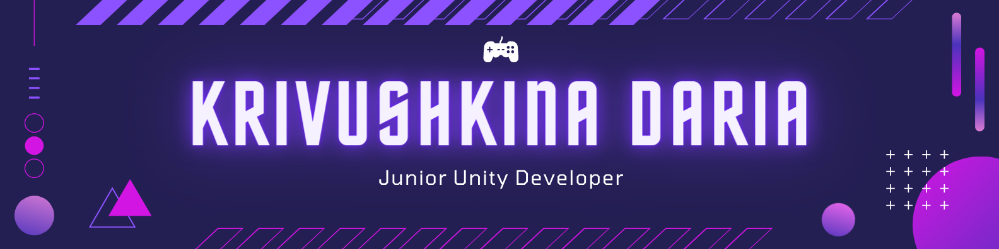
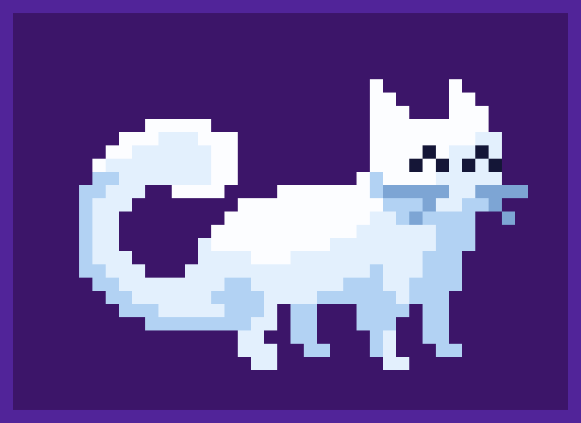

## Welcome everyone 👋💜

I'm Daria, a young and creative Junior Unity Developer from Belarus 🇧🇾. The woman who from childhood is eager to develop games. Now it's no longer a dream, but a favorite occupation in which I develop daily and aspire to be a professional. My mission is to create and develop exciting and fulfilling games, putting all my heart into them. I work hard on the code and maintain its quality. Being a perfectionist I either do things well or not do them at all.

Want to know more about me? *=Check my social media:=*

&ensp;

# 🎮 My games
To be added soon.

&ensp;

# 💻 See the code

&ensp;

# 🎇 My best projects

&ensp;

# 🟪 Key skills

&ensp;

## ⬛ Additional skills

&ensp;

## ◼️ Have experience

&ensp;

### ◼️ Software

&ensp;

### ◾ Other
Leadership, stress resistance, problem-solving, creative approach, quick learning ability, fall in love with games 💜.

&ensp;

# 🌎 Languages

 
 
 

&ensp;

# 📊 GitHub Stats

&ensp;

# ✉️ Connect with me

